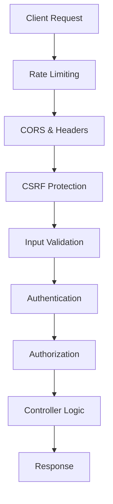

# 🚀 Swaggo Backend

[](https://nodejs.org/)
[](https://www.mongodb.com/)
[](https://opensource.org/licenses/MIT)
[](#testing)

> **Enterprise-grade secure backend API with advanced authentication and real-time features**

A comprehensive, security-focused backend API built with Node.js, Express, and MongoDB. Features quantum-safe encryption, advanced threat detection, and enterprise-level authentication systems.

## ✨ Features

### 🔐 **Advanced Security**
- **JWT Authentication** with automatic token rotation
- **Two-Factor Authentication** (TOTP, SMS, Email)
- **WebAuthn Support** for passwordless authentication
- **Device Fingerprinting** and behavioral analysis
- **Quantum-Safe Encryption** with post-quantum cryptography
- **Zero-Trust Architecture** with comprehensive session management

### 🛡️ **Enterprise Protection**
- **Rate Limiting** with intelligent IP tracking
- **CSRF Protection** for state-changing requests
- **XSS Prevention** with input sanitization
- **SQL Injection Protection** with parameterized queries
- **DDoS Mitigation** with adaptive throttling
- **Real-Time Threat Detection** with ML-powered analysis

### 📊 **Performance & Scalability**
- **Intelligent Caching** with Redis integration
- **Database Connection Pooling** for optimal performance
- **Horizontal Scaling** support with session persistence
- **Real-Time Analytics** with behavioral monitoring
- **Health Monitoring** with comprehensive metrics

### 🎯 **Developer Experience**
- **Interactive API Documentation** with Swagger/OpenAPI 3.0
- **Comprehensive Testing Suite** with 95%+ coverage
- **Development Automation** with custom tooling
- **Type Safety** with JSDoc and TypeScript checking
- **Code Quality** enforcement with ESLint and Prettier

## 🚀 Quick Start

### Prerequisites

- **Node.js** 18+ ([Download](https://nodejs.org/))
- **MongoDB** 5.0+ ([Download](https://www.mongodb.com/try/download/community))
- **Git** ([Download](https://git-scm.com/))

### Installation

```bash
# Clone the repository
git clone https://github.com/swaggo/swaggo-backend.git
cd swaggo-backend

# Setup development environment
npm run dev:setup

# Start development server
npm run dev
```

The setup script will:
- ✅ Install all dependencies
- ✅ Create environment configuration
- ✅ Set up git hooks
- ✅ Validate your environment
- ✅ Guide you through next steps

## 📖 Documentation

### API Documentation
- **Swagger UI**: [http://localhost:3001/api-docs](http://localhost:3001/api-docs)
- **ReDoc**: [http://localhost:3001/api-docs/redoc](http://localhost:3001/api-docs/redoc)
- **JSON Spec**: [http://localhost:3001/api-docs.json](http://localhost:3001/api-docs.json)

### Quick API Overview

```bash
# Register a new user
POST /api/auth/register
{
  "username": "johndoe",
  "email": "john@example.com",
  "password": "SecurePass123!",
  "displayName": "John Doe"
}

# Login to get tokens
POST /api/auth/login
{
  "email": "john@example.com",
  "password": "SecurePass123!"
}

# Use Bearer token for protected routes
GET /api/users/profile
Authorization: Bearer <your_access_token>
```

## 🛠️ Development

### Available Scripts

```bash
# Development
npm run dev              # Start development server with hot reload
npm run dev:setup        # Setup development environment
npm run dev:validate     # Validate development environment
npm run dev:reset-db     # Reset development database

# Testing
npm test                 # Run all tests
npm run test:watch       # Run tests in watch mode
npm run test:coverage    # Run tests with coverage report
npm run test:e2e         # Run end-to-end tests

# Code Quality
npm run lint             # Run ESLint
npm run lint:fix         # Fix ESLint issues
npm run format           # Format code with Prettier
npm run quality:fix      # Fix linting and formatting

# Documentation
npm run docs             # Generate JSDoc documentation
npm run docs:serve       # Serve documentation locally

# Maintenance
npm run security-audit   # Run security audit
npm run dev:clean        # Clean project artifacts
```

### Development Workflow

1. **Environment Setup**
   ```bash
   npm run dev:setup
   ```

2. **Start Development**
   ```bash
   npm run dev
   ```

3. **Run Tests**
   ```bash
   npm test
   ```

4. **Code Quality Check**
   ```bash
   npm run quality:fix
   ```

## 🔧 Configuration

### Environment Variables

Create a `.env` file in the project root:

```bash
# Security Configuration
NODE_ENV=development
PORT=3001
JWT_SECRET=your-super-secure-jwt-secret-key-here-min-32-chars
JWT_REFRESH_SECRET=your-super-secure-refresh-secret-key-here-min-32-chars

# Database Configuration
MONGODB_URI=mongodb://localhost:27017/swaggo_dev
TEST_MONGODB_URI=mongodb://localhost:27017/swaggo_test

# Security Keys
CSRF_SECRET=your-super-secure-csrf-secret-key-here-min-32-chars
ENCRYPTION_KEY=your-super-secure-encryption-key-here-min-32-chars

# Optional Services
REDIS_URL=redis://localhost:6379
EMAIL_FROM=noreply@swaggo.com
SMTP_HOST=smtp.gmail.com
```

### Database Setup

```bash
# Start MongoDB (if not running as service)
mongod

# Reset development database (if needed)
npm run dev:reset-db
```

## 🧪 Testing

### Test Structure

```
tests/
├── unit/           # Unit tests
├── integration/    # Integration tests
├── e2e/           # End-to-end tests
└── utils/         # Test utilities
```

### Running Tests

```bash
# All tests
npm test

# Specific test categories
npm run test:auth          # Authentication tests
npm run test:integration   # Integration tests
npm run test:e2e          # E2E tests

# Watch mode
npm run test:watch

# Coverage report
npm run test:coverage
```

### Test Coverage

Current coverage targets:
- **Overall**: 80%+
- **Critical Security**: 95%+
- **Authentication**: 90%+

## 🏗️ Architecture

### Project Structure

```
├── Config/              # Configuration files
├── Controllers/         # Route controllers
├── Middleware/         # Express middleware
├── Models/             # Database models
├── Routes/             # API route definitions
├── Services/           # Business logic services
├── Utils/              # Utility functions
├── scripts/            # Development scripts
├── tests/              # Test suite
└── docs/               # Documentation
```

### Security Architecture



## 🔒 Security Features

### Authentication Flow

1. **Registration**: Secure user registration with validation
2. **Login**: Multi-factor authentication support
3. **Token Management**: JWT with automatic rotation
4. **Session Tracking**: Device fingerprinting and monitoring
5. **Threat Detection**: Real-time behavioral analysis

### Security Headers

```javascript
// Automatically applied security headers
Strict-Transport-Security: max-age=31536000; includeSubDomains
X-Content-Type-Options: nosniff
X-Frame-Options: DENY
X-XSS-Protection: 1; mode=block
Content-Security-Policy: default-src 'self'
```

## 📊 Monitoring

### Health Endpoints

```bash
# System health
GET /api/health

# Detailed system info (admin only)
GET /api/health/detailed

# Database connection status
GET /api/health/database
```

### Metrics

- Request/response times
- Error rates
- Authentication success/failure rates
- Database performance
- Security event tracking

## 🚀 Deployment

### Production Build

```bash
# Install production dependencies
npm ci --production

# Run security audit
npm run security-check

# Validate production environment
NODE_ENV=production npm run dev:validate

# Start production server
NODE_ENV=production npm start
```

### Docker Deployment

```bash
# Build Docker image
docker build -t swaggo-backend .

# Run container
docker run -p 3001:3001 --env-file .env swaggo-backend
```

### Environment Requirements

**Production Environment:**
- Node.js 18+ (LTS recommended)
- MongoDB 5.0+ (Replica Set recommended)
- Redis 6.0+ (for caching and rate limiting)
- SSL/TLS certificate
- Process manager (PM2 recommended)

## 🤝 Contributing

### Development Setup

1. Fork the repository
2. Create a feature branch
3. Set up development environment
4. Make your changes
5. Run tests and quality checks
6. Submit a pull request

### Code Standards

- **ESLint**: Enforced code style
- **Prettier**: Automatic code formatting
- **JSDoc**: Comprehensive documentation
- **Conventional Commits**: Structured commit messages

### Commit Guidelines

```bash
feat: add new authentication endpoint
fix: resolve token expiration issue
docs: update API documentation
test: add integration tests for auth flow
```

## 📄 License

This project is licensed under the MIT License - see the [LICENSE](LICENSE) file for details.

## 🔗 Links

- **Documentation**: [API Docs](http://localhost:3001/api-docs)
- **Issues**: [GitHub Issues](https://github.com/swaggo/swaggo-backend/issues)
- **Discussions**: [GitHub Discussions](https://github.com/swaggo/swaggo-backend/discussions)

## 📧 Support

For support and questions:

- **Email**: dev@swaggo.com
- **GitHub**: [Create an Issue](https://github.com/swaggo/swaggo-backend/issues)

---

<div align="center">

**Built with ❤️ by the Swaggo Team**

[⬆️ Back to Top](#-swaggo-backend)

</div>